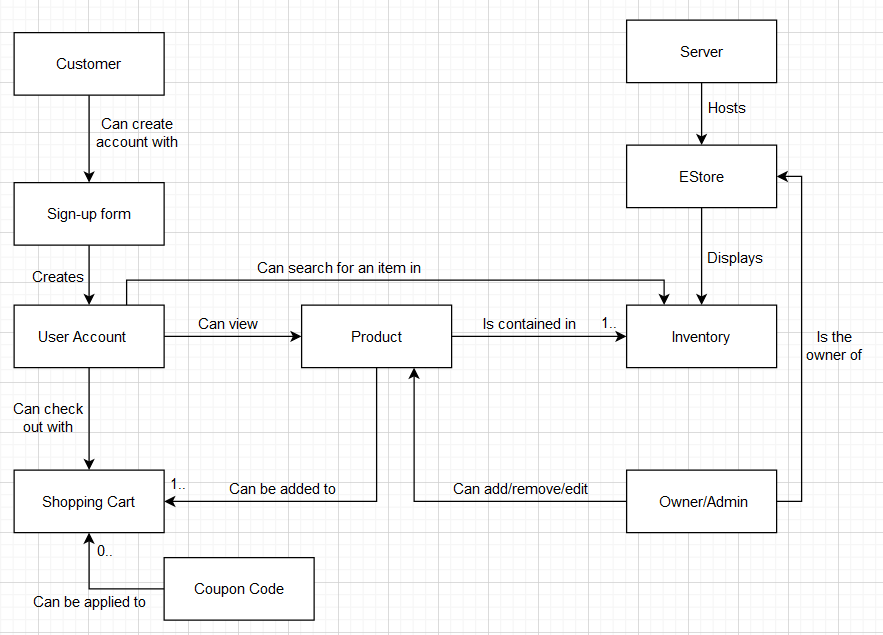

# PROJECT Design Documentation

## Team Information
* Team name: Team 3
* Team members
  * Chris Shepard
  * Alec Haag
  * Blake Hinkley
  * Ian Dunn

## Executive Summary

This is an e-commerce store, users can login into the store and browse for products, they are also able to add/remove products to their shopping cart. If the username is admin, they will have the ability to add/remove/edit products from the inventory. This site uses .json files in order to store item information

### Purpose

The purpose of this site is to be able to shop for various plant products, it demonstrates agile team developement using angular for the front end and java for the back end. 

### Glossary and Acronyms

| Term | Definition |
|------|------------|
| SPA  | Single Page - An application using a dynamic framework to serve one interactive page.|
| DAO  | Data Access Object - A class to manipulate data from a model without directly interacting with the model.|

## Requirements

This section describes the features of the application.

### Definition of MVP
A user should be able to log in and out of the site, they should be able to see all of the products as well as search for a specific product, they can add and remove items from their shopping cart as well as check out. If they log out of their account, all of the products should remain in their cart if they choose to log back in. The admin of the store should only be able to see the inventory, so they can add/edit/remove items from it. We also added the ability to apply coupons to items in the cart making them cheaper. 

### MVP Features
> _Provide a list of top-level Epics and/or Stories of the MVP._
  * EPIC(USER LOGIN)
    * Story (Log into Account)
    * Story (Log out of Account)
    * Story (File I/O With shopping cart)
  * EPIC(CUSTOMER FUNCTIONALITY) 
    * Story (Search for a product)
    * Story (Change Inventory)
    * Story (Add / Remove Item from Shopping cart)
  * EPIC(ADMIN FUNCTIONALITY)
    * Story (Remove Product)
    * Story (Add Product)
    * Story (View Product)
    * Story (Edit Product)
    * Story (View Inventory)
  * EPIC(COUPON FEATURE)
    * Story (Create Coupons)
    * Story (Coupons affect price)
  * EPIC(SHOPPING CART)
    * Story (File I/O With shopping cart)
    * Story (Change Inventory)

### Roadmap of Enhancements
  * Customer Functionality
  * Admin Functionality
  * User login
  * Shopping cart
  * Coupon Feature

## Application Domain

This section describes the application domain.

## Architecture and Design

This section describes the application architecture.

### Summary

The following Tiers/Layers model shows a high-level view of the webapp's architecture.

The e-store web application, is built using the Model–View–ViewModel (MVVM) architecture pattern. 

The Model stores the application data objects including any functionality to provide persistance. 

The View is the client-side SPA built with Angular utilizing HTML, CSS and TypeScript. The ViewModel provides RESTful APIs to the client (View) as well as any logic required to manipulate the data objects from the Model.

Both the ViewModel and Model are built using Java and Spring Framework. Details of the components within these tiers are supplied below.

### Overview of User Interface

This section describes the web interface flow; this is how the user views and interacts with the e-store application.

### View Tier

The View Tier UI is built using the Angular framework and is a SPA with built-in application routing and templating to have the appearance of multiple unique pages.

There are several components in the View Tier UI:
  * The `homepage` component is the homepage of the website, and contains an overview and information about the founders.
  * The `loginpage` component is the login page of the website, and is what allows for users to login or create accounts when the input username is unrecognized
  * The `cart` component is the shopping cart of a user, it displays the contents of the shopping cart as well as a button to apply coupons
  * The `product-detail` component is designed to be a singular page that provides the product details as well as the button to add to the cart.
    * The `product-editor` component is similar to the `product-detail` component, except instead of the displayed product details, there are fields that dynamically update the current product details.
  * The `products` component is a list of products to go on the inventory page that has a deletable option - when enabled, this option adds a button to delete a product.
  * The `product-creator` component is a form, where on submission, it sends a POST request to the API to create a product based on the field values.
    * This component contains a `product-detail` component with the deletable property enabled so as to be an "admin page."
  * The `product-search` component contains the search bar and a list of search results.

  

### ViewModel Tier

The ViewModel is written in Java and provides the RESTful API services using the Spring Framework to a client (in this case the View Tier) as well as the Data Access Objects to manipulate the stored data in the Model.

The Model stores the application data objects including any functionality to provide persistance.

### Model Tier

The Model tier is also written in Java, providing a template for objects and storing the objects' data. The data is persistently stored in a JSON file and read from and written to by the DAO's in the ViewModel Tier.

* The `Product` Model contains 5 JSON properties - `id`, `name`, `copies`, `description`, and `price`.
* The `User` Model contains 1 JSON property - `name`.
* The `Cart` Model contains 3 JSON properties - `user`, `items`, and `total`.
* The `Coupon` Model contains 4 JSON properties - `id`, `name`, `discount`, and `products`.

### Static Code Analysis/Design Improvements
> _Discuss design improvements that you would make if the project were
> to continue. These improvement should be based on your direct
> analysis of where there are problems in the code base which could be
> addressed with design changes, and describe those suggested design
> improvements._

We would've liked to have an in-website way to add coupons but we ran out of time before we could
finalize that component of the coupon feature, this likely would've taken a little bit more time
to create the page and then configure the buttons and input lines assuming no conflicting code was 
found. We also struggled a bit with creating tests for coverage, it would likely have been better for the tests to be written parallel to the controllers themselves but with time feeling strained we strived for pure functionality. There likely should've been more discussion between members about what was expected for the solution tasks of a feature, occasionally when building off another teammate's feature there would have to be serious refactoring in order to get it to synergize with the feature trying to be implemented. This would mean more careful watch of pulls and more thorough reviews, it can be very difficult at a glance to see the conflicts that may arise when you start trying to build off of someone else's feature.

> _With the results from the Static Code Analysis exercise, 
> discuss the resulting issues/metrics measurements along with your analysis
> and recommendations for further improvements. Where relevant, include 
> screenshots from the tool and/or corresponding source code that was flagged._

We need to look at what bugs are being reported for the ui to make sure they aren't
impeding our ability to connect the front end functionality with the back end as well as 
creating more tests to have better coverage for the api.

## Testing
Current build passes tests for all features except the admin's ability to add and update coupons

### Acceptance Testing
For the user stories on the current master branch and updated [Trello Board](https://trello.com/b/pJwi0WXt/e-store-project-template-26103-team-3-c):

#### Passing All Acceptance Critera:

##### Sprint 3

* Login/logout of account
* FileIO with shopping cart
* Change inventory
* Coupons affect price

##### Sprint 2

* Update a product
* Add a product
* Remove Product
* View Product
* View Inventory

##### Sprint 1

* Create New Product
* Delete a single product
* Get a single product
* Get Entire Inventory
* Search for product
* Update a product

#### Passing Some Acceptance Criteria:

##### Sprint 2

* Create coupons

##### Sprint 2

* Log out of Account

#### Passing No Acceptance Critera:

##### Sprint 2

* Log into Account
* Add / Remove item to shopping cart
* Search for a Product

### Unit Testing and Code Coverage
> _Discuss your unit testing strategy. Report on the code coverage
> achieved from unit testing of the code base. Discuss the team's
> coverage targets, why you selected those values, and how well your
> code coverage met your targets. If there are any anomalies, discuss
> those._

#### Unit Testing

Our current unit testing strategy is to write general unit tests for success and then a few for failure. After that, we will generate a code coverage report; from there, we can determine where the unit tests are lacking in coverage.

#### Code Coverage

Most recent [code coverage report](https://mycourses.rit.edu/d2l/common/viewFile.d2lfile/Database/Mjc0OTE0Njk/Team%203%20-%20%20Code%20Coverage%20Analysis.docx?ou=983478) results:
  * Controller Tier: 90% coverage
  * Model Tier: 75% coverage
  * Persistence Tier: 27% coverage

Currently our main coverage target is to meet at least 70% coverage on the persistence tier. The main issue comes from almost all our methods checking if the products we are trying to alter or get exist. Fixing these issues will involve creating new failure test cases and fixing the edge cases if the products do not exist.